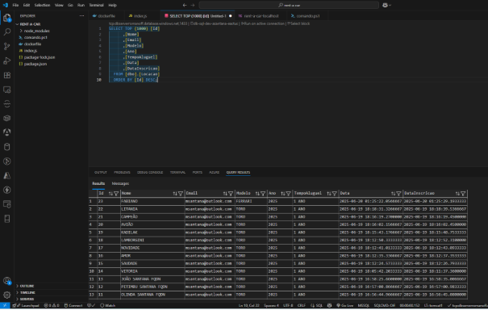
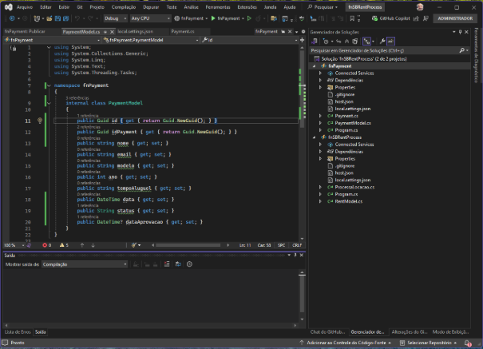
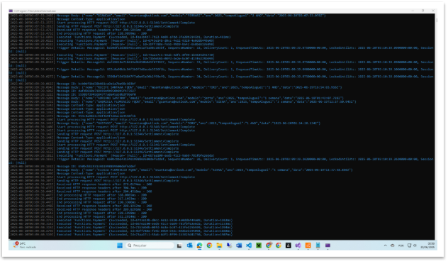
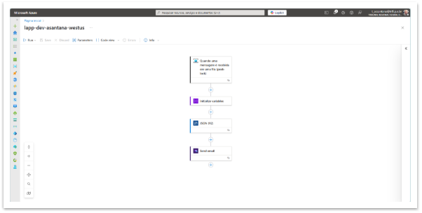

**Construção de uma Aplicação de Aluguel de Carros totalmente Cloud-Native**

**Documentação De Execução Do Projeto – Lado Azure**

**Azure DB**

**Client Request**

**Front-End em Node.js**

**Codigo .NET Functions Azure**

**Over View de Todos os Recursos**

**JSON ARM DE ALGUNS DOS RECURSOS**

**LAB007 | Resource Group**

{

`    `"id": "/subscriptions/653c100c-d96c-4ee6-8cc9-db5eecea84ed/resourceGroups/LAB007",

`    `"name": "LAB007",

`    `"type": "Microsoft.Resources/resourceGroups",

`    `"location": "eastus",

`    `"tags": {

`        `"Grupo007": "Projeto final"

`    `},

`    `"properties": {

`        `"provisioningState": "Succeeded"

`    `},

`    `"apiVersion": "2020-06-01"

}

**acrlab007asantana | Container Register**

{

`    `"sku": {

`        `"name": "Basic",

`        `"tier": "Basic"

`    `},

`    `"type": "Microsoft.ContainerRegistry/registries",

`    `"id": "/subscriptions/653c100c-d96c-4ee6-8cc9-db5eecea84ed/resourceGroups/LAB007/providers/Microsoft.ContainerRegistry/registries/acrlab007asantana",

`    `"name": "acrlab007asantana",

`    `"location": "eastus",

`    `"tags": {},

`    `"properties": {

`        `"loginServer": "acrlab007asantana.azurecr.io",

`        `"creationDate": "2025-06-18T00:09:09.806872Z",

`        `"provisioningState": "Succeeded",

`        `"adminUserEnabled": false,

`        `"policies": {

`            `"quarantinePolicy": {

`                `"status": "disabled"

`            `},

`            `"trustPolicy": {

`                `"type": "Notary",

`                `"status": "disabled"

`            `},

`            `"retentionPolicy": {

`                `"days": 7,

`                `"lastUpdatedTime": "2025-06-18T00:09:21.9152068+00:00",

`                `"status": "disabled"

`            `}

`        `}

`    `},

`    `"apiVersion": "2019-05-01"

}

**akv-asantana-dev-eastus | Key Vault**

{

`    `"id": "/subscriptions/653c100c-d96c-4ee6-8cc9-db5eecea84ed/resourceGroups/LAB007/providers/Microsoft.KeyVault/vaults/akv-asantana-dev-eastus",

`    `"name": "akv-asantana-dev-eastus",

`    `"type": "Microsoft.KeyVault/vaults",

`    `"location": "eastus",

`    `"tags": {},

`    `"properties": {

`        `"sku": {

`            `"family": "A",

`            `"name": "Standard"

`        `},

`        `"tenantId": "e5c29000-8c38-4b00-a096-2d0f6f4296cd",

`        `"networkAcls": {

`            `"bypass": "None",

`            `"defaultAction": "Allow",

`            `"ipRules": [],

`            `"virtualNetworkRules": []

`        `},

`        `"accessPolicies": [],

`        `"enabledForDeployment": false,

`        `"enabledForDiskEncryption": false,

`        `"enabledForTemplateDeployment": false,

`        `"enableSoftDelete": true,

`        `"softDeleteRetentionInDays": 90,

`        `"enableRbacAuthorization": true,

`        `"vaultUri": "https://akv-asantana-dev-eastus.vault.azure.net/",

`        `"provisioningState": "Succeeded"

`    `},

`    `"apiVersion": "2016-10-01"

}

**Telas de Execução da Function**

**CosmosDB Funcionando**

**Banco de Dados Configurado** 

**Service Bus e suas Filas**

**Passo Final – Logic App**

